```{r setup}
library(knitr)

# Load libraries
library(kableExtra)
library(here)
# library(wesanderson)
library(gridExtra)
library(tidyverse)
library(ERforResearch)
library(stringr)
library(readr)

# Source needed functions

opts_chunk$set(echo = FALSE, out.extra = "", warning = FALSE,
               message = FALSE, cache.lazy = FALSE)
options(knitr.kable.NA = "---")

re_sample <- FALSE
```


```{r get-data}
# Load the data from Zenodo:
path_to_xlsx <- "https://zenodo.org/record/4531160/files/individual_votes.xlsx"
stem_mat <- openxlsx::read.xlsx(xlsxFile = path_to_xlsx, sheet = "pm_stem")
stem <- stem_mat %>% 
  get_right_data_format(prefix_assessor = "voter")

assessor_coi <-
  stem %>% 
  group_by(assessor) %>% 
  count() %>% 
  mutate(assessor_coi = n != 18) %>% 
  select(-n)
proposal_coi <-
  stem %>% 
  group_by(proposal) %>% 
  count() %>% 
  mutate(proposal_coi = n != 29) %>% 
  select(-n)

stem <- stem %>% 
  left_join(assessor_coi) %>% 
  left_join(proposal_coi) 
```

```{r some-helper-functions}
## Some helper functions for later:
# Function to extract the Intraclass correlation coefficient (ICC) from the 
# matrix of individual votes:
get_icc_from_matrix <- function(individual_votes) {
  (individual_votes %>% 
     select(-proposal) %>% 
     mutate_all(function(x) ERforResearch:::get_num_grade_snsf(x)) %>% 
     as.data.frame() %>% 
     psych::ICC(x = ., missing = FALSE))$results %>% 
    filter(type == "ICC3") %>% # A fixed set of k judges rates each target
    mutate(icc = paste0(round(ICC, 2), " (",
                        round(`lower bound`, 2), "; ", 
                        round(`upper bound`, 2), ")")) %>% 
    pull(icc) %>% 
    return()
}

# Function to graphically represent all the votes, and the ICC from the
# matrix of individual votes:
get_grades_plot <- function(long_individual_votes, individual_votes_mat = NULL,
                            x_min = NULL, x_max = NULL, title = "",
                            jitter_h = .02, jitter_w = .025,
                            jitter_alpha = .5){
  if (is.null(x_min)){
    x_min <- long_individual_votes %>% pull(num_grade) %>% min
    x_min <- ifelse(x_min > 1, x_min - 1.2, x_min -.2)
  }
  if (is.null(x_max)){
    x_max <- long_individual_votes %>% pull(num_grade) %>% max
    x_max <- ifelse(x_max < 6, x_max + 1.2, x_max +.2)
  }
  if (!is.null(individual_votes_mat)){
    icc <- get_icc_from_matrix(individual_votes_mat)
    title <- paste0(ifelse(title == "", "ICC = ",
                           paste0(title, ": ICC = ")), icc)
  }
  plot_data <- long_individual_votes %>% 
    group_by(proposal) %>% 
    mutate(avg = mean(num_grade, na.rm = TRUE)) %>% 
    ungroup() 
  plot_data <- plot_data %>% 
    select(proposal, avg) %>% 
    distinct() %>% 
    arrange(avg) %>% 
    mutate(order = 1:n()) %>% 
    select(-avg) %>% 
    left_join(plot_data, by = "proposal")
  plot_data %>% 
    ggplot(aes(x = num_grade, y = order)) + 
    geom_jitter(aes(color = "Individual Votes"), height = jitter_h, 
                width = jitter_w, alpha = jitter_alpha, size = 1) +
    geom_point(aes(x = avg, color = "Average"), size = 1.5) + 
    theme_minimal() +
    scale_y_continuous(breaks = unique(plot_data$order),
                       labels = 
                         as.numeric(str_extract_all(unique(plot_data$proposal),
                                                    "[0-9]+"))) +
    labs(x = "Assessor Vote", y = "Ordered proposal", title = title) +
    lims(x = c(x_min, x_max)) +
    scale_color_manual(name = " ", 
                       values = c("Average"="#FF6F6F",
                                  "Individual Votes" = "#848383")) +
    theme(axis.text.y = element_blank(),
          legend.position = c(0.5, .5),
          axis.title.y = element_blank(),
          panel.grid.major.y = element_line(size = .1))
}


```

## Who am I \Smiley{} 
\textcolor{green!40!black}{\textbf{Slides}: https://osf.io/8nhrj}

\vspace{.25cm}

\pause
-   Finished PhD in Biostatistics at University of Zurich in 2019

\pause
-   From 2019--2022: Statistician at the Swiss National Science Foundation

\pause

-   2022--2025: Postdoctoral fellow in meta-research at the Center for Reproducible Science, UZH \vspace{.25cm}

-   Since 2025: Senior Researcher at the Center for Reproducible Science **and Research Synthesis**, UZH \vspace{.25cm}

\pause
-   Research focused on reproducibility, Open Science & research funding allocation systems \vspace{.25cm}

-   Training in good research practices \vspace{.25cm}
\pause 
-   **\textcolor{orange}{Disclaimer}**: Open Science enthusiast, actively involved in the Swiss Reproducibility Network and CoARA (Coalition for Advancing Research Assessment)


## My work in the SNSF data team

## My work in the SNSF data team, illustrated via Gender Stats

**Communicating the effect of gender in research funding**


\pause 


Three interacting bodies: 

- \textcolor{orange}{Gender Equality Commission}: independent advisory body with international members \vspace{.75cm}

- \textcolor{violet}{Gender Equality Office}: supports internal bodies in implementing necessary measures \vspace{.75cm}
  
- \textcolor{blue}{Data Team}: statisticians and data scientists supporting the office


## My work in the SNSF data team, illustrated via Gender Stats

**Communicating the effect of gender in research funding**

Three interacting bodies: 

- \textcolor{orange}{Gender Equality Commission}: independent advisory body with international members

  + _advises_ \textcolor{violet}{Gender Equality Office} \vspace{.25cm}

- \textcolor{violet}{Gender Equality Office}: supports internal bodies in implementing necessary measures

  + _reports to_ \textcolor{orange}{Gender Equality Commission} and mandates analyses to \textcolor{blue}{Data Team} \vspace{.25cm}
  
- \textcolor{blue}{Data Team}: statisticians and data scientists supporting the office

## Lockdown: Are women submitting fewer grant proposals?

\pause

From COVID "gender publication gap" to "gender application gap" \vspace{.5cm}

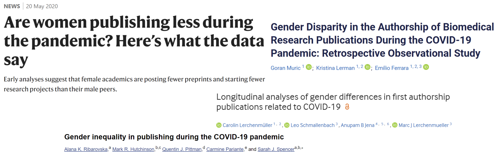{height=250px} 

## Lockdown: Are women submitting fewer grant proposals?
Analysed the share of female applicants applying to funding schemes with deadlines during or shortly after the lockdown. \vspace{.75cm}

Note:

* Lockdown with school closures in March 2020
* Postponement of Project Funding deadline from the 1 to 8 April

## Female shares: Normal Project Funding

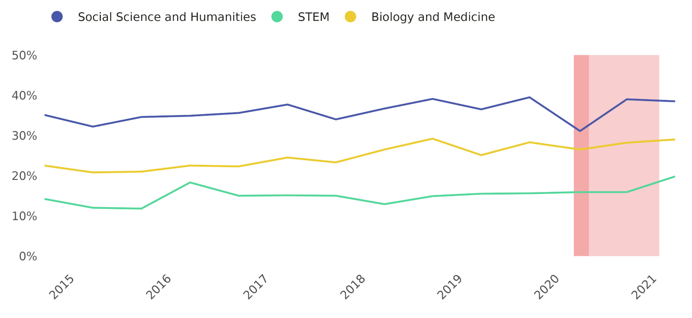{height=250px} 
\footnotesize \url{https://data.snf.ch/stories/women-submitting-fewer-grant-proposals-en.html}


## What is evidence-based science policy making?

\pause 
::: {.callout-note} 
# Evidence-based policy
*Evidence-based policy refers to the practice of informing public policy decisions through the use of scientific evidence and rigorous research, a concept that has its roots in evidence-based medicine*.

<br> 

\footnotesize Source: \url{https://www.ebsco.com/research-starters/social-sciences-and-humanities/evidence-based-policy}\vspace{-.25cm}
:::

\pause
  
::: {.callout-note} 
# Science policy
*Science policy is concerned with the allocation of resources for the conduct of science towards the goal of best serving the public interest. Topics include the funding of science, the careers of scientists, and the translation of scientific discoveries into technological innovation to promote commercial product development, competitiveness, economic growth and economic development*.

<br> 

\footnotesize Source: Wikipedia \vspace{-.25cm}
:::
  


## Research funding decisions

Focus on **competitive funding** by national and international scientific funding organisations 

\pause 

$\Rightarrow$ They shape the research landscape: which research is done, and by whom?

\pause 

$\Rightarrow$ Lack of research & innovation going into decision-making **processes** (lack of evidence based policy making)


## A standard funding decision-making process


```{r, out.width="\\linewidth", include=TRUE, fig.align="center", echo=FALSE}
knitr::include_graphics("img/Evaluationsystem.pdf")
```
\pause 

- Process depends on organisation, call and funding scheme (career vs. project)
- Often considered a black-box


## How do funding organisation take decisions, in practice?

<!-- **In practice?** -->

## The case of the SNSF, prior to 2022

```{r, out.width="\\linewidth", include=TRUE, fig.align="center", echo=FALSE}

```

## The case of the SNSF, prior to 2022
```{r, out.width="\\linewidth", include=TRUE, fig.align="center", echo=FALSE}
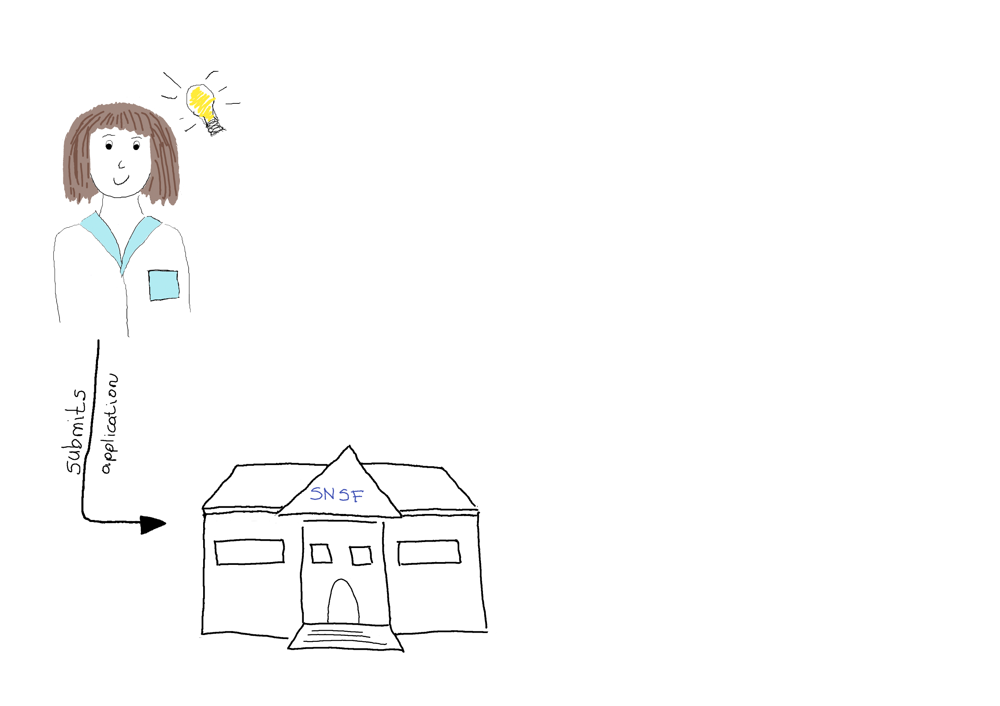
```

## The case of the SNSF, prior to 2022
```{r, out.width="\\linewidth", include=TRUE, fig.align="center", echo=FALSE}
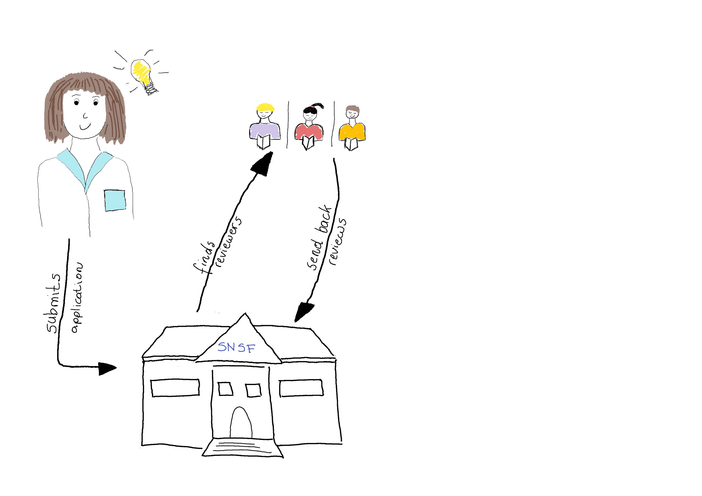
```


## The case of the SNSF, prior to 2022
```{r, out.width="\\linewidth", include=TRUE, fig.align="center", echo=FALSE}
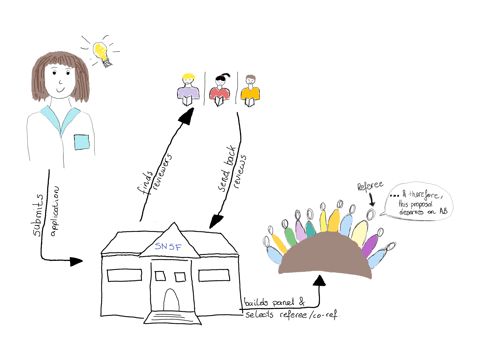
```

## The case of the SNSF, prior to 2022
```{r, out.width="\\linewidth", include=TRUE, fig.align="center", echo=FALSE}
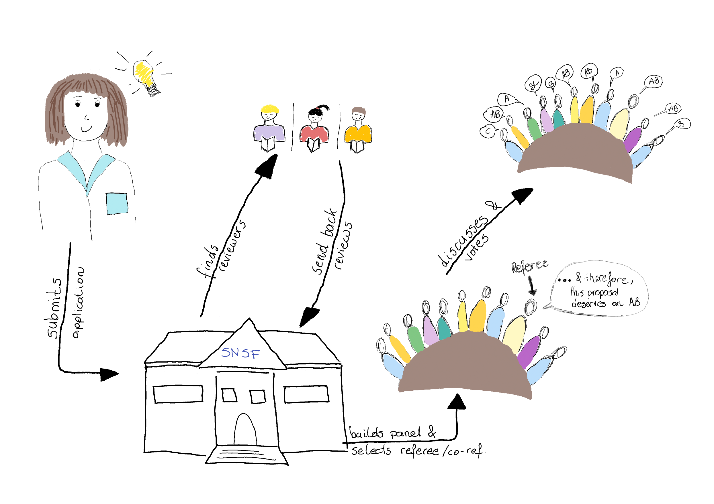
```

## The case of the SNSF, prior to 2022

**ID** | **V1** | **V2** |  **V3** | **V4** | **V5** | **V6** | **V7** | **V8** | **V9** | **V10** | **V11** | **Av**
--| -- | -- |-- | -- |-- | -- |-- | -- |-- | -- |-- | --
\#1 | C | AB | A | BC | B | AB | AB | A | AB | AB| B | 4.55 
\#2 | C | AB | A | BC | **COI** | AB | AB | A | AB | AB | B | 4.6
\#3 | A | A | .. | .. | .. | .. | .. | .. | .. | C | A |4.73
\#4 | A | AB | .. | .. | .. | .. | .. | .. | .. | **COI** | A | 5.63
\#5 | C | C |.. | .. | .. | .. | .. | .. | .. | C | BC | 2.33


## Concrete example: SNSF STEM panel & fellowships

```{r}

nb_cois <- sum(apply(stem_mat, 1, function(x) sum(is.na(x))))

stem %>% 
  summarise("Total nb of votes" = as.character(n()),
            "Nb proposals discussed" =
              as.character(n_distinct(proposal)),
            "Nb panel members" =
              as.character(n_distinct(assessor))) %>% 
  mutate("Nb fundable proposals" = "6",
         "Nb COIs" = as.character(nb_cois),  
         "Scale used" = "A, AB, B, BC, C, D") %>% 
  pivot_longer(cols = "Total nb of votes":"Scale used",
               names_to = " ", 
               values_to = "  ") %>% 
  kable(booktab = TRUE, col.names = NULL) 


```


## Concrete example: SNSF STEM panel & fellowships
```{r barplot, fig.width=5, fig.height=3, fig.align='center'}
plot_data <- stem %>% 
    group_by(proposal) %>% 
    mutate(avg = mean(num_grade, na.rm = TRUE)) %>% 
    ungroup() %>% 
    select(proposal, avg) %>% 
    distinct() %>% 
    arrange(avg) %>% 
    mutate(order = 1:n()) %>% 
    # select(-avg) %>% 
    left_join(stem, by = "proposal")

plot_data %>% 
  group_by(grade) %>% 
  summarise(count = n() ) %>% 
  ggplot(aes(x = grade, y = count)) +
  geom_col(fill = "#18ac7a", color = "white") +
  labs(y = "Count", x = " ") + 
  theme_classic()

```


## Variation within proposals


```{r variation-by-proposals, fig.width=6, fig.height=3, fig.align='center'}
set.seed(1)
plot_data %>% 
  ggplot(aes(x = as.factor(order), y = num_grade)) +
  geom_violin(fill = alpha("#18ac7a", .6), linewidth = 1, 
              color = alpha("#18ac7a", .6)) +
  geom_jitter(size = 1.5, height = .15, color = "#A3A3A3",
              width = .2, alpha = .6) + 
  # geom_point(data = plot_data %>% select(order, avg) %>% distinct(),
             # aes(y = avg), col = "#9A1542", size = 6, pch = 13) +
  theme_classic() + 
  # scale_color_manual(values = c("#A3A3A3", "black")) +
  labs(y = "Assessor Vote", x = "Ordered proposal") +
  scale_y_continuous(breaks = 1:6,
                     labels = c("D", "C", "BC", "B", "AB", "A"),
                     limits = c(1, 6.2)) +
  theme(axis.text.x = element_blank(),
        legend.position = "none")
```


## Variation within proposals

```{r variation-by-proposals2, fig.width=6, fig.height=3, fig.align='center'}
set.seed(1)
plot_data %>% 
  ggplot(aes(x = as.factor(order), y = num_grade)) +
  geom_violin(fill = alpha("#18ac7a", .6), linewidth = 1, 
              color = alpha("#18ac7a", .6)) +
  geom_jitter(size = 1.5, height = .15, aes(color = proposal_coi), #color = "#A3A3A3",
              width = .2, alpha = .6) + 
  # geom_point(data = plot_data %>% select(order, avg) %>% distinct(),
             # aes(y = avg), col = "#9A1542", size = 6, pch = 13) +
  theme_classic() + 
  scale_color_manual(values = c("#A3A3A3", "black")) +
  labs(y = "Assessor Vote", x = "Ordered proposal") +
  scale_y_continuous(breaks = 1:6,
                     labels = c("D", "C", "BC", "B", "AB", "A"),
                     limits = c(1, 6.2)) +
  theme(axis.text.x = element_blank(),
        legend.position = "none")
```

## Variation within proposals 

```{r variation-by-proposals3, fig.width=6, fig.height=3, fig.align='center'}
set.seed(1)
plot_data %>% 
  ggplot(aes(x = as.factor(order), y = num_grade)) +
  geom_violin(fill = alpha("#18ac7a", .6), linewidth = 1, 
              color = alpha("#18ac7a", .6)) +
  geom_jitter(size = 1.5, height = .15, aes(color = proposal_coi), #color = "#A3A3A3",
              width = .2, alpha = .6) + 
  geom_point(data = plot_data %>% select(order, avg) %>% distinct(),
             aes(y = avg), col = "#9A1542", size = 6, pch = 13) +
  theme_classic() + 
  scale_color_manual(values = c("#A3A3A3", "black")) +
  labs(y = "Assessor Vote", x = "Ordered proposal") +
  scale_y_continuous(breaks = 1:6,
                     labels = c("D", "C", "BC", "B", "AB", "A"),
                     limits = c(1, 6.2)) +
  theme(axis.text.x = element_blank(),
        legend.position = "none")
```

## Variation within assessors


```{r variation-by-assessor, fig.width=6, fig.height=3, fig.align='center'}
set.seed(1)
plot_data %>% 
  ggplot(aes(x = assessor, y = num_grade)) +
  geom_violin(fill = alpha("#18ac7a", .6), linewidth = 1, 
              color = alpha("#18ac7a", .6)) +
  geom_jitter(size = 1.5, height = .15, color = "#A3A3A3",
              width = .2, alpha = .6) + 
  theme_classic() + 
  labs(y = "Assessor Vote", x = "Assessors") +
  scale_y_continuous(breaks = 1:6, labels = c("D", "C", "BC", "B", "AB", "A"),
                     limits = c(1, 6.2)) +
  theme(axis.text.x = element_blank(),
        legend.position = "none")
```

## Variation within assessors 

```{r variation-by-assessor2, fig.width=6, fig.height=3, fig.align='center'}
set.seed(1)
plot_data %>% 
  ggplot(aes(x = assessor, y = num_grade)) +
  geom_violin(fill = alpha("#18ac7a", .6), linewidth = 1, 
              color = alpha("#18ac7a", .6)) +
  geom_jitter(size = 1.5, height = .15, aes(color = assessor_coi),
              width = .2, alpha = .6) + 
  theme_classic() + 
  labs(y = "Assessor Vote", x = "Assessors") +
  scale_color_manual(values = c("#A3A3A3", "black")) +
  scale_y_continuous(breaks = 1:6, labels = c("D", "C", "BC", "B", "AB", "A"),
                     limits = c(1, 6.2)) +
  theme(axis.text.x = element_blank(),
        legend.position = "none")
```


## Problems for the applicant

- Decisions do not seem to be based on quality of research project

  - arbitrary
  - black box
  
## Problems of the funder

- How to discriminate between similarly good proposals?

\pause

- How to account for dependency, uncertainty, variability in the data?

\pause

- But, **simplicity of averages!**


## Problems from a statistical point of view
\pause
- Dependencies: all panel members grade every other proposal
  - mixed models problem
  
\pause

- Averages do not work well with outliers (easy to game...)

\pause
- Disregarding variability (e.g., induced by COIs) is problematic

\pause

- Averages of ordinal data far from optimal 

\pause

- Reliance on sub-optimal estimations of quality:

    $\Rightarrow$ Panel member grades are known to be unreliable
    
    $\Rightarrow$ Panel member grades can be biased
    


## OK... but what now?


\pause

Need to 

- Model process "correctly"

\pause

- Quantify uncertainty and variability

\pause

- Acknowledge uncertainty and variability in the decision-making process

\pause

$\Rightarrow$ Split scientific evaluation and funding decision 
<!-- (no biased funding$line discussions) -->

$\Rightarrow$ Improve transparency and reproducibility of decision-making process 


```{r useERforResearch-get-mcmc}
if (re_sample){
  stem_mcmc <- get_mcmc_samples(data = stem, 
                                id_proposal = "proposal",
                                id_assessor = "assessor", 
                                grade_variable = "num_grade", 
                                n_iter = 100000,
                                n_burnin = 8000, 
                                n_adapt = 2000,
                                names_variables_to_sample = 
                                  c("proposal_intercept", "tau_proposal", 
                                    "tau_assessor", "rank_theta", 
                                    "nu"))
  write_rds(stem_mcmc, file = "stem_mcmc.rds")
}

stem_mcmc <- readRDS("stem_mcmc.rds")
```


```{r plot-results}


plot_assessor_stem <- 
  assessor_behavior_distribution(get_mcmc_samples_result = stem_mcmc,
                                 names_assessors = "assessor",
                                 n_assessors = stem %>% 
                                   summarise(n_distinct(assessor)) %>% pull(),
                                 xlim_min = -1.25,
                                 xlim_max = 1.05,
                                 scale = 2.5)

plot_proposal_stem <-
  assessor_behavior_distribution(get_mcmc_samples_result = stem_mcmc,
                                 names_assessors = "proposal",
                                 name_mean = "proposal_intercept",
                                 n_assessors = stem %>%
                                   summarise(n_distinct(proposal)) %>% pull(),
                                 xlim_min = -1.01, xlim_max = .8,
                                 scale = 2.5)

ranks_stem <- get_er_from_jags(data = stem,
                               id_proposal = "proposal",
                               id_assessor = "assessor", 
                               grade_variable = "num_grade",
                               mcmc_samples = stem_mcmc)

plot_stem <-  
  plotting_er_results(ranks_stem, result_show = TRUE, title = "STEM",
                      id_proposal = "id_proposal",
                      pt_size = .5, line_size = .2, draw_funding_line = FALSE, 
                      line_type_fl = "longdash", 
                      color_fl = "darkgray", grep_size = 3,
                      how_many_fundable = 6) 

plot_er_dist_stem <- 
  plot_er_distributions(get_mcmc_samples_result = stem_mcmc,
                        n_proposals = stem %>% 
                          summarise(n_distinct(proposal)) %>% pull(),
                        name_er = "rank_theta", title = " ",
                        number_fundable = 6,
                        outer_show = FALSE, proposal = "")

```


## Proposed solution at the SNSF

\textcolor{green!40!black}{Model better}

- Let's assume a proposal of a certain quality $\theta_i$ is submitted for funding 

- ... [evaluation process] ...

\pause

- All panel members vote: given their expertise, biases and past experiences, voter $j$ **estimates the quality of proposal $i$**
      
  $\rightarrow$ $y_{ij}$, $i \in \{1, \dots, n\}$ and $j \in \{1, \dots, m\}$

\pause

- Bayesian Hierarchical Model (given some priors) for the panel votes:
\begin{eqnarray}
y_{ij} \ | \ \theta_i, \lambda_{ij}& \sim &  N(\bar{y} + \theta_i + \lambda_{ij}, \sigma^2)\nonumber \\
\theta_i  &\sim & N(0, \tau^2_{\theta}) \nonumber \\
\lambda_{ij}  &\sim&  N(\nu_j, \tau^2_{\lambda}). \nonumber
\end{eqnarray}
  

## Proposed solution at the SNSF

\textcolor{green!40!black}{Quantify/model uncertainty}
\pause

\vspace{-.25cm}
```{r variation-by-assessor-modeled, fig.width=5, fig.height=2.5, fig.align='center'}
plot_assessor_stem + 
  labs(title = "Modeling the assessor behaviour")
```


## Proposed solution at the SNSF

\textcolor{green!40!black}{Quantify/model uncertainty}
\pause

\vspace{-.25cm}
```{r variation-by-proposals-modeled,fig.width=5, fig.height=2.5, fig.align='center'}
plot_proposal_stem + 
  labs(title = "Modeling the proposal quality")
```

<!-- Model and extract the **distribution of the rank of the $\theta_i$** to achieve the Bayesian Ranking. -->

## Proposed solution at the SNSF

\textcolor{green!40!black}{Acknowledge uncertainty via lottery}

\pause

\vspace{-.25cm}
```{r modeled-ranks, fig.width=6, fig.height=2.7, fig.align='center'}
plot_er_dist_stem  
```


## Bayesian ranking in practice

\vspace{-.25cm}

```{r, out.width=".8\\linewidth", include=TRUE, fig.align="center", echo=FALSE}
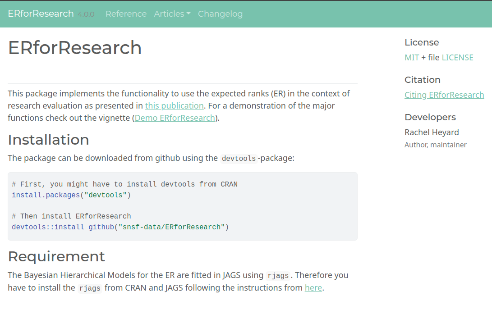
```

\vspace{-1.1cm}
\small \url{https://snsf-data.github.io/ERforResearch/}


## Bayesian ranking paper


```{r, out.width=".7\\linewidth", include=TRUE, fig.align="center", echo=FALSE}
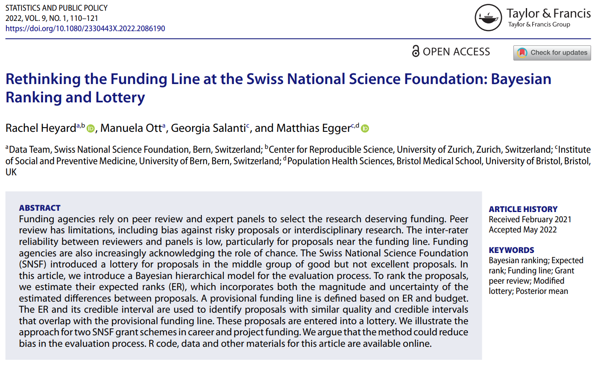
```

\vspace{-.5cm}
\small \url{https://doi.org/10.1080/2330443X.2022.2086190}

## Generalisability of the approach to other funders

- First implementation for SNSF.

\pause

- With some expertise in Bayesian hierarchical models, generalisable to other funders/situations.

\pause

- **But**, impossible to develop a one-size fits all tool.

## The case of the Marie Skłodowska-Curie actions (MSCA)


```{r, out.width=".75\\linewidth", include=TRUE, fig.align="center", echo=FALSE}
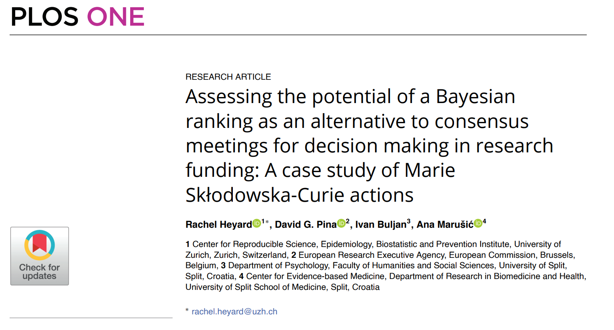
```

\vspace{-.5cm}
\small \url{https://doi.org/10.1371/journal.pone.0317772}

## Decision-making MSCA

- Individual evaluation reports (three criteria and overall score)
  - Three experts per proposal
  - Scores on scale from 1 to 100

\pause
  
- Consensus meetings
  - Consensus report

\pause

  
- Ranking based on consensus report 
  - Main list (accepted), Reserve list, Rejected list


## How useful are individual expert scores in predicting consensus score?

\vspace{-.6cm}
```{r, out.width=".5\\linewidth", include=TRUE, fig.align="center", echo=FALSE}
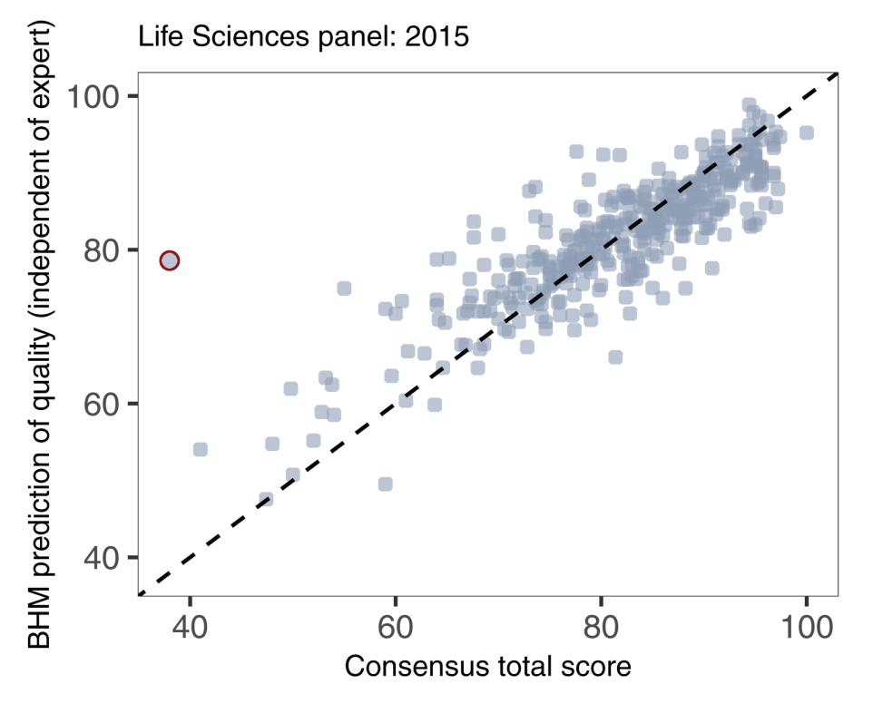
```

\vspace{-.25cm}
\small Bayesian hierarchical model prediction of quality using: $\bar{y} + \theta_i$.


## How useful are individual expert scores in predicting consensus ranking?

```{r, out.width=".75\\linewidth", include=TRUE, fig.align="center", echo=FALSE}
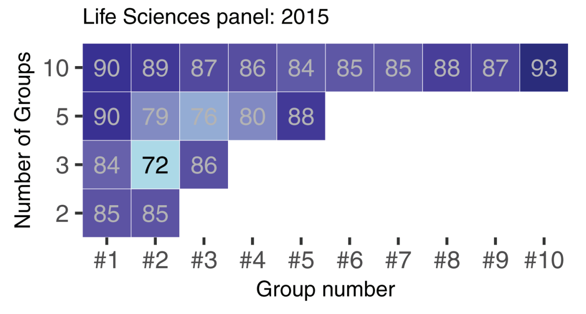
```


## Pros and cons of Bayesian Ranking

**+** Quantify uncertainty with respect to the true rank  
**+** Truly comparative ranking  
**+** Adjust for grading habits of panel members (and possible of panels)

<br> <br>

**-** Higher complexity  
**-** Longer and intense computation needed


## Bayesian Ranking adopted by the SNSF and fully integrated in process in fall 2022

**Lessons learned** 

- Bayesian Ranking is a (still imperfect) decision making tool
- Limitations and assumptions need to be clearly communicated
- Development and implementation process needs to be communicated transparently and all panel members should be included in discussion ($e.g.$ no black box)  

<!-- - Methodology implemented in `R`-package available on github [ERforResearch](https://github.com/snsf-data/ERforResearch)   -->
<!--    Scientific publication available from _Statistics and Public Policy_ [DOI: 10.1080/2330443X.2022.2086190](https://www.tandfonline.com/doi/full/10.1080/2330443X.2022.2086190) -->


## What's next for Bayesian ranking methodologies?

- So much we do not understand yet.

\pause

- Using available evidence better! criteria scores, external experts vs. panel members, ...


\pause

$\Rightarrow$ Taking a more holistic approach -- from call design to funding decision. 

## Thank You!

**Collaborators -- Gender Stats:**  
Simona Isler, Laura Lots, Julius Mattern, Anne Jorstad

**Collaborators -- Bayesian Ranking:**  
Manuela Ott, Georgia Salanti, Matthias Egger. David Pina, Ivan Buljan, Ana Marusic

\vspace{.25cm}

\hrule
\vspace{.25cm}

**Rachel Heyard**  

Email: \texttt{rachel.heyard@uzh.ch}  
Website: \url{http://rachelheyard.com/}

\vspace{.25cm}

\hrule
\vspace{.25cm}

Center for Reproducible Science and Research Synthesis – University of Zurich
Website: \url{https://www.crs.uzh.ch}

## License{.smaller}

{height=100px}  
This presentation is licensed with a CC-BY international license 4.0 https://creativecommons.org/licenses/by/4.0/

Available from github: [rachelhey.github.io/talks/Bern_lecture](rachelhey.github.io/talks/Bern_lecture).

Please cite as: R Heyard "Data science and visualisation for evidence-based science policy", Interdisciplinary Data Science Lecture Series, 2026 [osf.io/8nhrj](https://osf.io/8nhrj).


