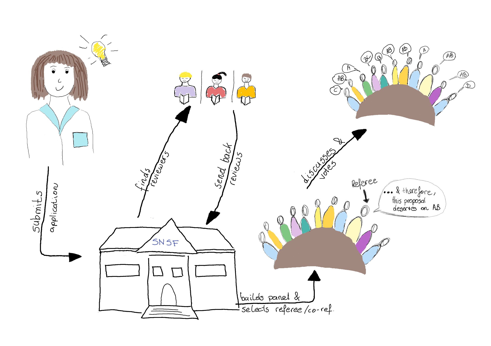
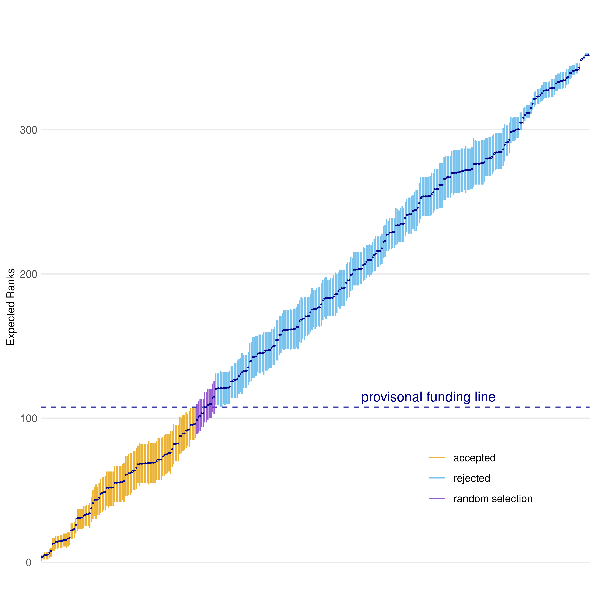

```{r setup, include=FALSE}
knitr::opts_chunk$set(echo = FALSE)
```

## Bayesian Ranking (1)
\vspace{-.15cm}
<center>
{width=75%}
</center>

## Bayesian Ranking (2)

From idea to funding decision at the SNSF (prior to 2022):


\tiny

**ID** | **V1** | **V2** |  **V3** | **V4** | **V5** | **V6** | **V7** | **V8** | **V9** | **V10** | **V11** | **Av**
--| -- | -- |-- | -- |-- | -- |-- | -- |-- | -- |-- | --
\#1 | C | AB | A | BC | B | AB | AB | A | AB | AB| B | 4.55 
\#2 | C | AB | A | BC | **COI** | AB | AB | A | AB | AB | B | 4.6
\#3 | A | A | .. | .. | .. | .. | .. | .. | .. | C | A |4.73
\#4 | A | AB | .. | .. | .. | .. | .. | .. | .. | **COI** | A | 5.63
\#5 | C | C |.. | .. | .. | .. | .. | .. | .. | C | BC | 2.33

\normalsize

\pause 

We need a method that:  
$\rightarrow$ allows to split scientific evaluation and funding decision.     
$\rightarrow$ defines the funding line and a lottery group in a consistent, transparent and reproducible way.

## Bayesian Ranking (3)


- Let's assume that  $y_{ij}$ is the estimation of the quality of proposal $i$ by voter $j$, $i \in \{1, \dots, n\}$ and $j \in \{1, \dots, m\}$.

- Bayesian Hierarchical Model (given some priors) for the panel votes:
\begin{eqnarray}
y_{ij} \ | \ \theta_i, \lambda_{ij}& \sim &  N(\bar{y} + \theta_i + \lambda_{ij}, \sigma^2)\nonumber \\
\theta_i  &\sim & N(0, \tau^2_{\theta}) \nonumber \\
\lambda_{ij}  &\sim&  N(\nu_j, \tau^2_{\lambda}). \nonumber
\end{eqnarray}
  
- Model and extract the **distribution of the rank of the $\theta_i$** to achieve the Bayesian Ranking.

## Bayesian Ranking (4)


<center>
{width=50%}
</center>

## Replication success in the presence of questionable research practices - a simulation study 
### F. Freuli, L. Held, R.Heyard, 2022 (osf.io/preprints/metaarxiv/s4b65)

\small 
Different levels of four types of QRP:
_cherry picking, questionable interim analysis, questionable inclusion of covariates, questionable subgroup analysis,_

\pause

<center>
{width=55%}
</center>
